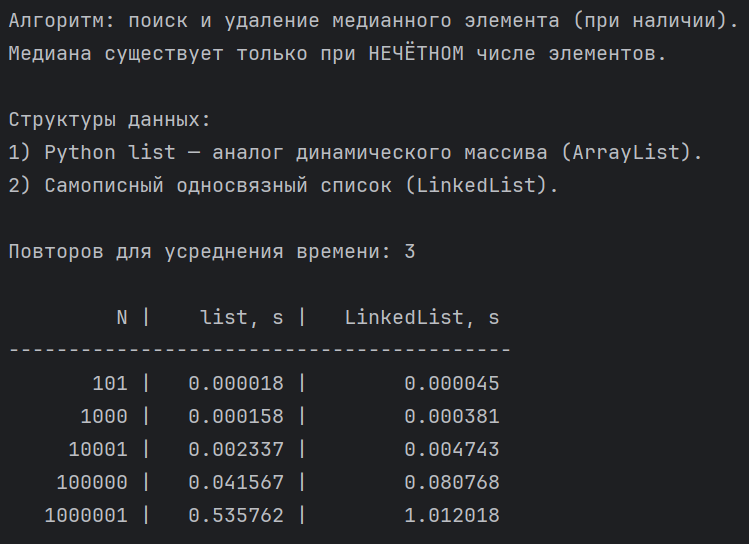
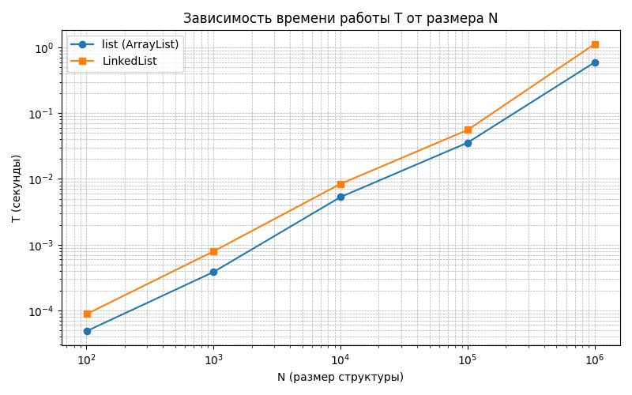

# Лабораторная работа 6. Поиск и удаление медианы (Python)

## Состав и вариант

Выполнил: Чевкин К.Д.  
Сумма букв в фамилии = 6 → вариант: алгоритм поиска и удаления медианного элемента (при наличии).
Сделано на оценку «Хорошо» (2 структуры данных, 2 реализации).

## Реализованные структуры и алгоритм

- ArrayList (встроенный `list`): поиск медианы через сортировку массива, удаление первого вхождения медианного значения.  
- Связный список (`LinkedList` на односвязных `Node`): значения временно копируются в массив для поиска медианы, после чего первое вхождение медианного значения удаляется из связного списка.  

Оба варианта используют одинаковые входные данные для честного сравнения (один и тот же набор случайных чисел).

Асимптотика по времени для обеих реализаций: **O(n log n)**, по памяти: **O(n)** за счёт временного массива.

## Исходный код

- `main.py` — реализация двух структур данных, алгоритма поиска и удаления медианы, замер времени и построение графика.

## Результаты измерений

Таблица и график времени работы от размера N:

  

На связном списке накладные расходы обхода узлов делают реализацию немного медленнее, хотя асимптотика у обеих реализаций одинаковая — O(n log n).
